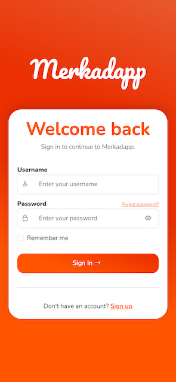
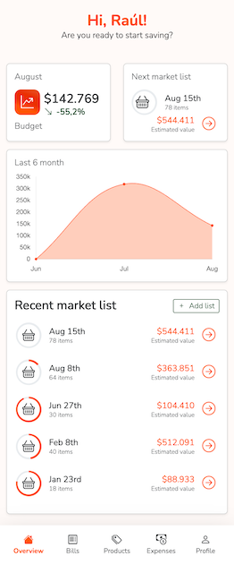
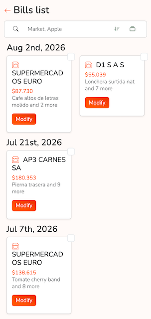
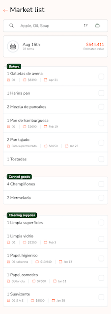

# Merkadapp

A personal grocery management and expense tracking SPA. Started as a practical solution for splitting shopping and expenses in a shared home — and used as a hands-on project to learn React from scratch.

Pairs with two backends:
- [merkadapp API](https://github.com/raulito1500/merkadapp) — Go + MongoDB, powers bills, products and market lists
- [merkadapp expenses API](https://github.com/raulito1500/merkadapp_expenses-api) — NestJS + MongoDB, powers shared/personal expenses and groups

## Stack

- **React 18** — functional components and hooks throughout
- **React Bootstrap** — responsive layout and UI components
- **React Bootstrap Typeahead** — tag-style input for group members
- **Chart.js** / react-chartjs-2 — spending visualization
- **React Router DOM v6** — client-side routing (`HashRouter`)
- **Context API** — global state for the API clients, auth, loading state and notifications
- **Axios** — HTTP client (separate instances for each backend)
- **SASS** — custom styles layered on top of Bootstrap
- **React Testing Library** — unit tests

## Features

- **Login** — lightweight username-based auth (no password check yet); session persisted in `localStorage`
- **Dashboard** — budget summary widget and 6-month spending chart
- **Bills** — log grocery runs with itemized products, bags and taxes; select and merge related bills
- **Products** — catalog organized by category and purchase frequency
- **Market lists** — create manually or auto-generate from product purchase history; check off items live via WebSocket
- **Recommendations** — surfaces products due for restocking based on their configured repeat interval
- **Expenses** — personal and group expense tracking against the new expenses API:
  - **Personal** — log personal expenses and move them into a group later
  - **Groups** — create groups with typeahead member entry, view group expenses, and see a per-member balance summary
  - move any expense between groups (or back to personal) after the fact

## Screenshots

| Login | Dashboard |
|---|---|
|  |  |

| Bills | Market list |
|---|---|
|  |  |

## Project structure

```
src/
├── App/
│   ├── Context/        # AppContext (Axios), AuthContext, expensesApi (2nd Axios instance)
│   ├── layouts/        # MainLayout (with navbar), BlankLayout (full screen)
│   ├── AppHeader/      # Navbar with login/logout and GitHub-avatar user menu
│   ├── Loader/
│   ├── AppNavbar/
│   └── Notifications/
├── components/         # Reusable: DataViewOptions, NumberPicker, PageTitle
├── Constants/          # Category labels and domain-level constants
├── features/
│   └── market-list/    # Market list creation and suggested list flow
├── Pages/
│   ├── Bill/           # List, Create, Edit
│   ├── Expense/        # Personal view, Create, shared ExpenseList
│   ├── Group/          # List, Create, View (summary + expenses)
│   ├── Login/
│   ├── Logout/
│   ├── MarketList/     # View, Widget, CreateSuggested
│   ├── Overview/       # Dashboard widgets (Budget, Chart, NextList, Welcome)
│   └── Product/        # List, BillHistory, Recommendations
└── utils/              # formatting, grouping, searching, sorting
```

## Local setup

**Prerequisites:** Node 18+, the [merkadapp API](https://github.com/raulito1500/merkadapp) running on port `8080`, and the [merkadapp expenses API](https://github.com/raulito1500/merkadapp_expenses-api) for the Expenses section

```bash
git clone https://github.com/raulito1500/merkadapp_frontend.git
cd merkadapp_frontend
npm install
npm start
```

Open `http://localhost:3000`. Login only checks the username against a hardcoded allow-list (no password/backend call yet) — use one of:

| User | Username |
|------|----------|
| Raúl | `raul` |
| Manuel | `manuel` |

### Environment variables

Each backend has its own base URL, read from the environment:

```env
# .env.development
REACT_APP_URL_BASE=http://localhost:8080
REACT_APP_EXPENSES_URL_BASE=http://localhost:3000

# .env.production
REACT_APP_URL_BASE=https://your-api-url.com
REACT_APP_EXPENSES_URL_BASE=https://your-expenses-api-url.com
```
